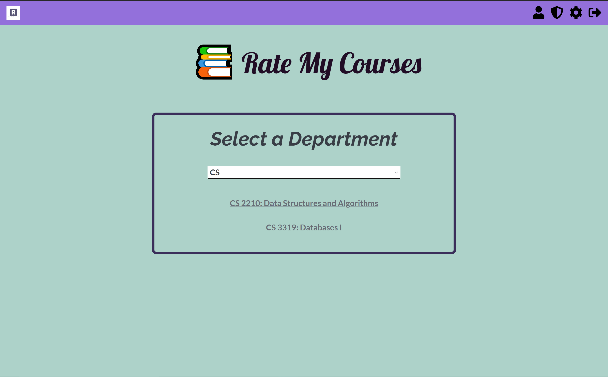
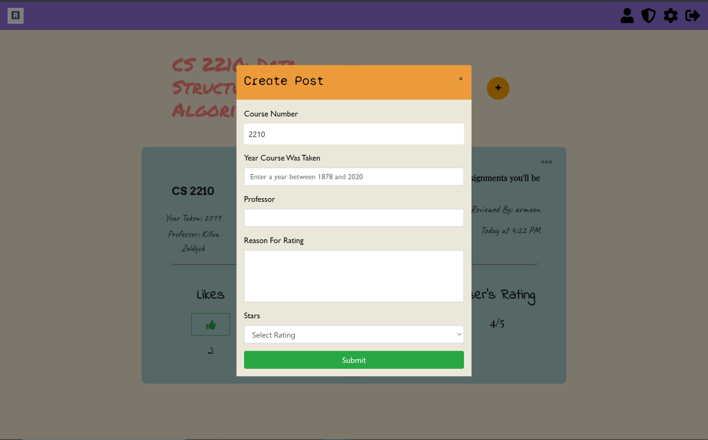
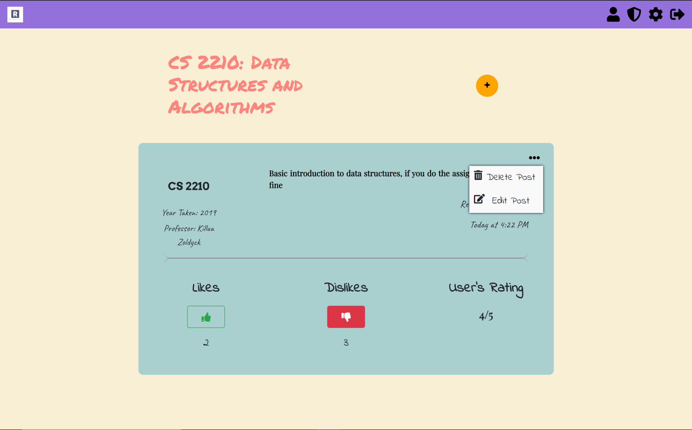
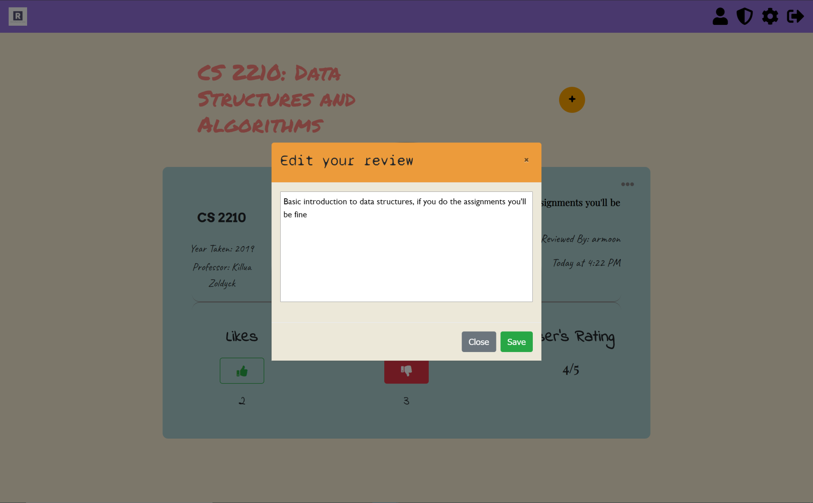
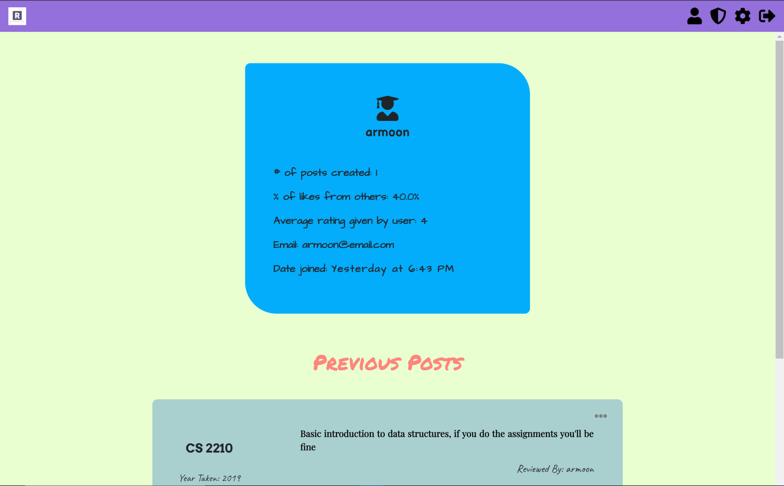
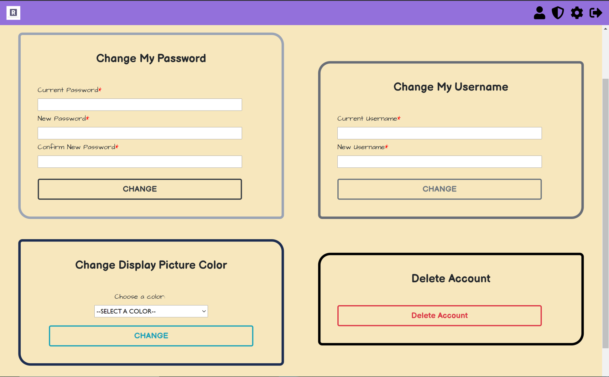
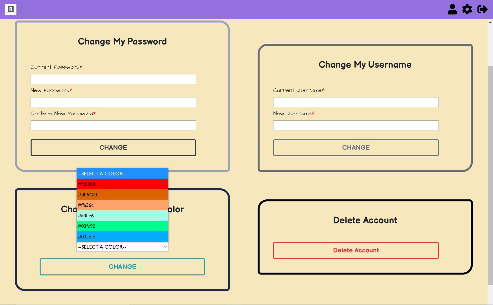
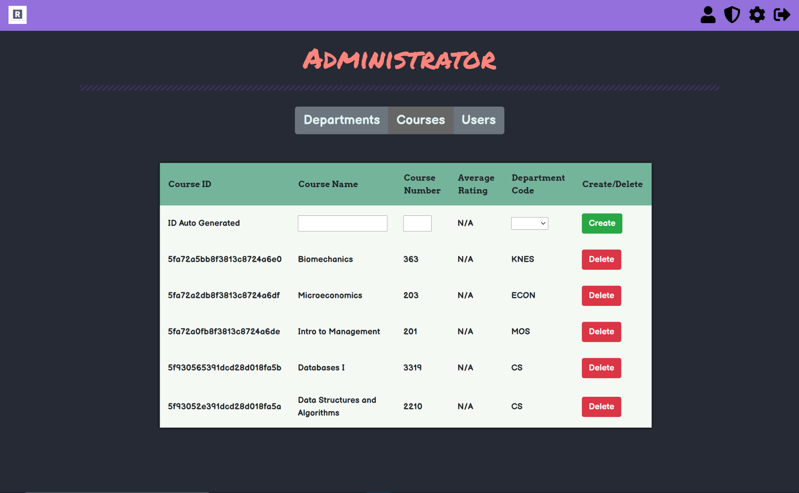

<h1>Rate My Courses</h1>

Rate My Courses is a responsive full stack application created using React.JS, Redux, Spring Boot, MongoDB, npm, and
styled using BootStrap 4.

The frontend uses React.js, Redux, and other npm packages such as axios, react-alert, react-confirm-alert, and moment.js
The backend uses Spring Boot (Java), which is used to connect to a NoSQL database, MongoDB.

This application authenticates users and allows them to execute CRUD operations when rating courses. 

Users are divided into two types: admin and regular users. 
Admin users have greater privileges that include CRUD operations on courses/departments.
Admins can also ban/unban users in real time. If a user is online when they are banned, the application 
will force them to logout within a maximum of 30 minutes.

 
</img>
 

All users can create, edit, and delete their own posts that rate a course in a certain department.
They can also like, dislike, and view other people's reviews.

 
</img>
 

Users have to be authenticated to access the settings for their own posts. These settings include deleting or editting their review 
on a particular course.

 
</img>
 

 
</img>
 

All users can view a list of statistics regarding the posts that they have created, as well as their personal data.
All the posts that they have created in the past will show up in their profile (unless it has been deleted by the user).

 
</img>
 

Users can access the settings page to change their username, password, the color of their profile, and even delete their account.
Users cannot change their username to one that already exists in the database.
Users must validate their current username/password in order for this change to be successful.

 
</img>
</img>
 

Admin page can only be accessed by admins.
A shield icon will show up on your navbar if you're an admin.

 
</img>
 

<h3>Architecture</h3>
The server is modelled using a Model - Repo - Service - Controller architecture. 
The Models are basically schemas that allow us to access/update fields that belong to them.
The Repo is a data access object that allows us to recieve/send Models to our database.
The Service uses Repositories to execute a certain operation specified by the client.
The Controller are routes that the client calls to request a certain operation. 

The server makes use of REST API.