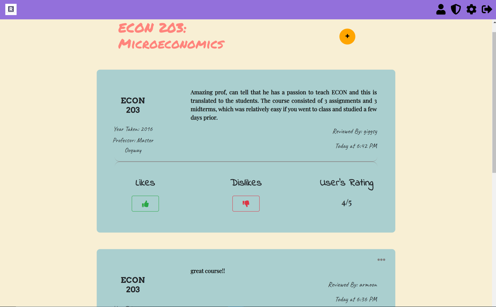
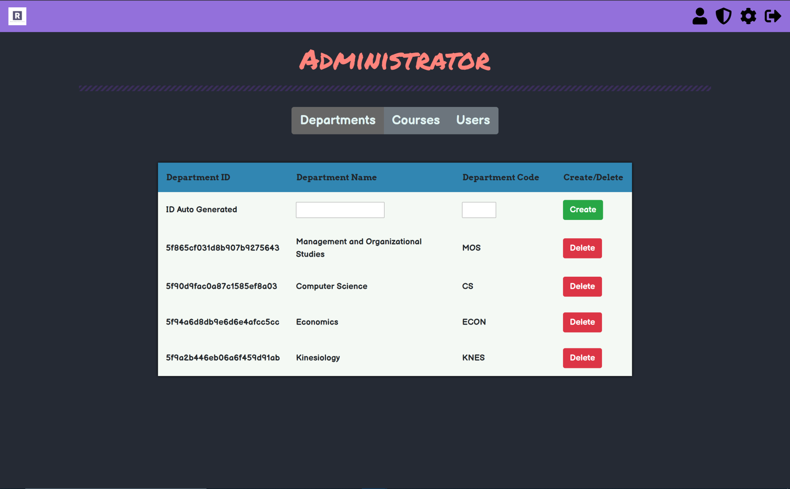

<h1>Rate My Courses</h1>

Rate My Courses is a responsive full stack application created using Javascript, Java, HTML, CSS, and stylized using Bootstrap 4. The frontend uses React to build the user interfaces and components while the backend uses Spring-boot to handle server side requests and interacts with a NoSQL database, MongoDB, to authenticate users and to keep track of posts, courses, and users.

This application authenticates users and allows them to create profiles with full CRUD capabilities. Users are divided into two types: admin and registered users. Admin users have greater privileges such as creating, reading, updating, and deleting departments & courses while registered users are only allowed to create, delete, update, like, and dislike posts.
 
</img>
 

View posts about a course by using the dropdown menu on the homepage and choosing a course. Each post has a review about the course and allows registered users to provide feedback in the form of liking or disliking a post.
 
</img>
 

Anyone is able to view posts however only registered users are allowed to like/dislike,create,update, and delete posts.
 
</img>
 

Registered users can edit their post by accessing the settings for each post and then they can either edit or delete it. Hover over the 3 dots to access settings.
 
</img>
 
 
</img>
 

Registered Users can view all of their statistics and posts on their profile page
 
</img>
 

Users can access their settings page to change their username, password, profile picture color, and delete their account.
 
</img>
 
 
</img>
 

Admins are responsible for creating departments and adding courses to each department
 
</img>
 
 
</img>
 

<h3>Architecture</h3>
The application is modeled using a client server model. The Server is modularized into 4 modules which are controller-model-repository-service. Client can send actions to the server's appropriate controller which handles each action for example PostController handles postActions. The controller will then call the required service which uses the repository and model to update the database. 

<h3>Running the Application Locally</h3>
*****Make sure you have all the neccessary dependencies & packages installed first**********
  
1. Run the server first by compiling & executing RateMyCoursesApplication.java
  
2. Run the client by running "npm start" in the path Rate-My-Courses\client\